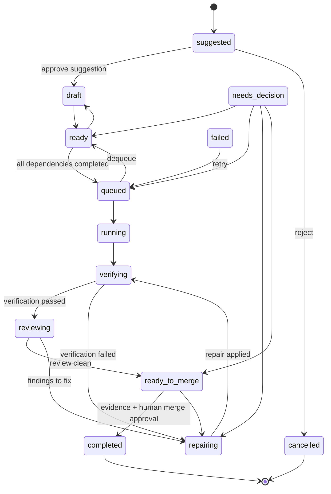

# Task lifecycle

Canonical statuses (defined in `src/domain/lifecycle.ts`, stored only on `tasks.status`):

```
suggested → draft → ready → queued → running → verifying → reviewing → ready_to_merge → completed
```

with `repairing`, `needs_decision`, `failed`, `cancelled` as the working/exception states.



(`running`, `verifying`, `reviewing`, `repairing`, `ready_to_merge` can each also reach
`needs_decision`, `failed`, or `cancelled`; omitted above for readability.)

## Guarded transitions

- **ready → queued** requires zero incomplete dependencies (`TaskDependency` rows whose
  target is not `completed`).
- **→ completed** requires the **completion proof set** (`src/domain/completion.ts`),
  evaluated inside the same transaction as the transition:
  - at least one QUALIFYING **passed** `verification_runs` record: status `passed`
    with exit code 0, completed start/end timestamps, produced under a **succeeded
    agent run of this same task** (the composite FK guarantees the task linkage), and
    cited by an append-only evidence row — a bare `passed` label proves nothing;
  - no open critical/major review findings — each must be fixed or carry an explicit
    disposition;
  - at least one evidence record whose relationships verify (a `verification_run`
    evidence must reference a real verification run of the same task — DB triggers
    refuse fabricated references at insert time);
  - any task-specific criteria from `tasks.completionCriteriaJson`: `requireArtifact`
    (a commit/branch/PR evidence ref) and `requiredDecisionCategories` (each category
    needs an approved DecisionRequest for this task).
- **running → queued** exists only as the crash-recovery requeue path (expired claim
  leases, `src/domain/claim-service.ts`).

Both guards refuse when the guard data wasn't supplied, so the service layer
(`transitionTask`) is the only practical entry point. Completion is additionally
enforced at the database boundary (drizzle/0004): triggers refuse any write that sets
`completed` from a status other than `ready_to_merge` or without a qualifying
verification run and clean findings — a direct SQL update cannot bypass the proof.
Verification records themselves are consistency-checked (`passed` requires exit code 0
and timestamps) and immutable once terminal.

## Transactions, claims and crash recovery

Every status change is a compare-and-swap on `(status, version)` inside a
`BEGIN IMMEDIATE` transaction — a concurrent writer makes the loser fail with
`ConcurrencyError` instead of silently clobbering. Execution is claimed through
`task_claims`: `claimNextTask` atomically inserts an active claim (durable worker id,
monotonic attempt number, lease expiry, heartbeat) and moves the task to `running`. The
DB enforces at most one active claim per task (partial unique index) and immutable
attempt history (triggers). `heartbeatClaim` extends the lease; `releaseClaim` hands the
task back (requeue) or cancels it; `recoverExpiredClaims` idempotently expires lapsed
leases and requeues their tasks after a crash — on the same connection or a fresh one
after restart.

The claim row (id + monotonic per-task attempt) is a **fencing token**: every owner
mutation — heartbeat, completion, release — requires the claim to be active AND its
lease still in the future, so a stalled worker is fenced out the instant its lease
expires, before any recovery sweep runs. Downstream writes bind to the token too:
`createRun` refuses a claim that is not the task's current active, unexpired claim.

## Suggested vs. real tasks

`suggested` is represented by a `task_suggestions` row, not a `tasks` row. Approving a
suggestion performs the `suggested → draft` transition by materialising the task (linked
back via `suggestionId`/`approvedTaskId`); rejecting it never touches the tasks table.
This keeps unapproved ideas out of every task query by construction.
