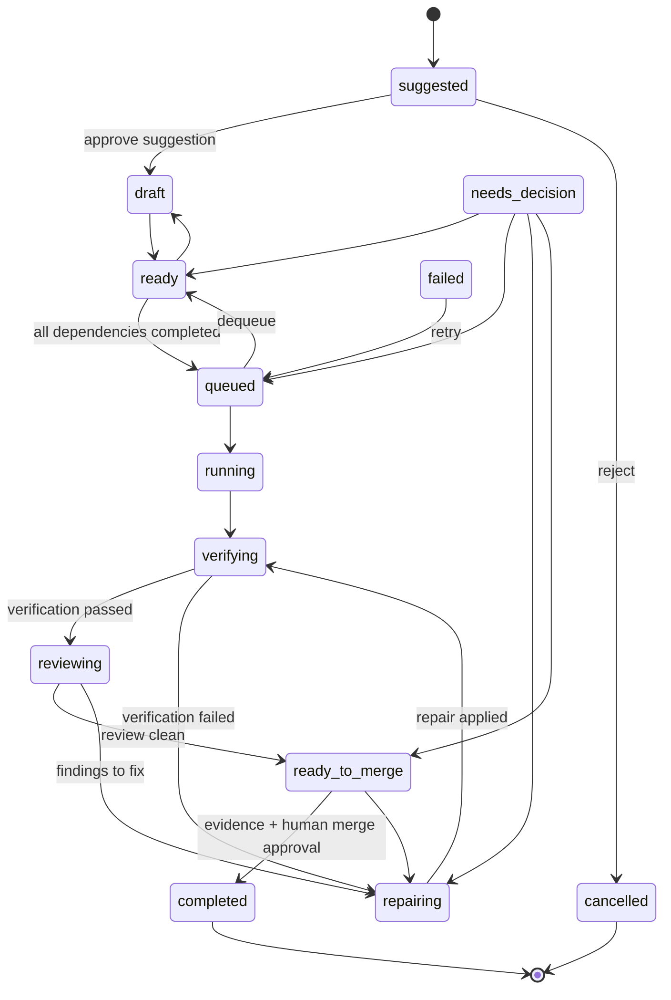

# Task lifecycle

Canonical statuses (defined in `src/domain/lifecycle.ts`, stored only on `tasks.status`):

```
suggested → draft → ready → queued → running → verifying → reviewing → ready_to_merge → completed
```

with `repairing`, `needs_decision`, `failed`, `cancelled` as the working/exception states.



(`running`, `verifying`, `reviewing`, `repairing`, `ready_to_merge` can each also reach
`needs_decision`, `failed`, or `cancelled`; omitted above for readability.)

## Guarded transitions

- **ready → queued** requires zero incomplete dependencies (`TaskDependency` rows whose
  target is not `completed`).
- **→ completed** requires at least one Evidence record. There is no evidence-free path
  to completion, mirroring the roadmap rule that nothing is marked Done without evidence.

Both guards refuse when the guard data wasn't supplied, so the service layer
(`transitionTask`) is the only practical entry point.

## Suggested vs. real tasks

`suggested` is represented by a `task_suggestions` row, not a `tasks` row. Approving a
suggestion performs the `suggested → draft` transition by materialising the task (linked
back via `suggestionId`/`approvedTaskId`); rejecting it never touches the tasks table.
This keeps unapproved ideas out of every task query by construction.
